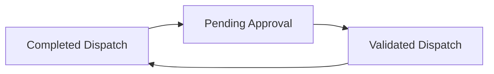

Here's a complete **Markdown API/Service documentation** for your `VehicleService` class, tailored to your DTOs, business logic, and the dispatch tracking flow of your system:

---

# 🚗 VehicleService – API Logic & Behavior Docs

The `VehicleService` class handles all core logic for managing vehicles in the system. This includes vehicle creation, dispatch lifecycle updates, health/wildcard status management, and vehicle queries.

---

## ✅ Dependencies

* `VehicleRepository`: Data access for `VehicleModel`
* `VehicleHealthService`: Handles health-related dispatch score logic
* `VehicleDataGenerator`: Generates fake VIN, license plates, and acquisition years

---

## 📘 Public Methods

### 1. `VehicleModel findVehicleByIdentificationNumber(String vin)`

Fetches a vehicle by VIN.
Throws `NotFoundException` if not found.

---

### 2. `VehicleModel markVehicleForMaintenance(String vin)`

Marks a vehicle as being under maintenance using wildcard attributes.

* If already marked, it updates the flag.
* If not, it adds a new wildcard attribute `IN_MAINTENANCE`.

---

### 3. `List<Long> getVehicleDispatchHistory(String vin)`

Returns the list of dispatch IDs associated with the given vehicle VIN.

---

### 4. `VehicleModel saveVehicle(VehicleDTO vehicleDTO)`

Creates a **new vehicle** entry using `VehicleDTO`.
Initializes:

* 100% safety score
* All health attributes at default values
* Wildcard flags all set to false

Uses `VehicleDataGenerator` to generate:

* VIN
* License Plate
* Acquisition Year

---

### 5. `VehicleModel saveBadVehicle(VehicleDTO vehicleDTO)`

Same as `saveVehicle()`, but with **degraded health values** and **random wildcard flags**.
Used for testing or simulating risky/unsafe vehicles.

---

### 6. `List<VehicleApiData> findAllVehicles()`

Returns a full list of vehicles in the database, mapped to the `VehicleApiData` DTO format.

---

### 7. `VehicleApiData getVehicleByVin(String vin)`

Returns detailed `VehicleApiData` info for a given VIN.
Throws `NotFoundException` if VIN is missing.

---

### 8. `void handleValidatedDispatch(ValidatedDispatch dispatchEvent)`

Transitions a vehicle from `PENDING` to `IN_PROGRESS`.
Adds dispatch ID to history.

* Validates that the vehicle is `PENDING`, otherwise throws `ConflictException`.

---

### 9. `void completedDispatch(DispatchEndedDTO dispatchEvent)`

Marks vehicle as `AVAILABLE` after a dispatch ends.

* Only allowed from `IN_PROGRESS` or `PENDING` state
* Throws `ConflictException` if not in valid state

---

### 10. `void handleDispatchTracking(StartTrackingDTO trackingEvent)`

Sets vehicle to `IN_PROGRESS` and appends dispatch to history (if not already added).

Throws:

* `ConflictException` if vehicle isn't `PENDING` or `IN_PROGRESS`
* `NotFoundException` if VIN doesn’t exist

---

### 11. `void handleVehicleLocationUpdate(vehicleLocationUpdate update)`

Updates the current vehicle's geographic checkpoint (latitude, longitude, timestamp).

---

### 12. `Map<String, Object> handleDispatchToVehicle(dispatchRequestBodyDTO dispatchEvent)`

* Marks a vehicle as `PENDING`
* Validates vehicle VIN
* Uses `VehicleHealthService` to generate dispatch score or feedback

---

## 🧩 DTOs Used

* [`VehicleDTO`](#): Vehicle creation/update
* `VehicleApiData`: Full vehicle view (with health, wildcards, dispatch)
* `ValidatedDispatch`: Admin approval event (sets `IN_PROGRESS`)
* `DispatchEndedDTO`: Dispatch finish event (sets `AVAILABLE`)
* `StartTrackingDTO`: Begins dispatch tracking
* `vehicleLocationUpdate`: Latitude/longitude & timestamp
* `dispatchRequestBodyDTO`: Incoming dispatch creation request

---

## 🔒 Enum Dependencies

From `VehicleEnums`:

* `VehicleStatus`
* `VehicleDispatchStatus`
* `DispatchReason`
* `VehicleHealthAttributeType`
* `VehicleWildCardType`

---

## 🔁 Status Flow (Dispatch Lifecycle)

---

## 🔍 Notes

* `VehicleModel` objects embed health and wildcard attributes via associated models.
* All state transitions are guarded with null and status validations.
* Some methods return DTOs while others operate directly on entities.

